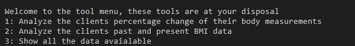

read me file for project 3.

PLANNING
1x. Create a googl sheet with informaton regaridng our clients progress. 
2x. create creds file so that the sheet can be accessed.
3x. add it and then add itto ignore.
4x. show all available sheets,
5x. pick sheet for the cleit you want
6. Be presented the options for you
7. pick option you want and fnction is run and rpesenting you with a list of % change in measuremtns
8x. one function tht calculates BMI change and tells you current state
9x. the other function will give you the percentage change in the meausremtns preented as a list. 
10. third function will do the calculaton and insert it into the sheet. 
11. errors need to be alerted and also possible to try again without crashing or found in no mans land.
12. p3clients
13x. requiremnts to run> imports and also isntall pip3, google ouath gsprad (pip3 install gspread google-auth)
14. used documentation https://docs.gspread.org/en/latest/user-guide.html

create a main fucnton whcih sets allthe variables and then executes the otehr funcitosn so in the menu we will simpy call th emenu funciton again. 

FEATURES
Following will explain each individual feature offered by the program and its intended use and benefit for the relevant parties.

Existing features
1.	Overview of all the available clients’ which records can be accessed, the function will print out the names individually of all the available worksheets inside the google sheet we are referring to. This is beneficial to the user as they will now which clients records are accessible and can be used with the tools.

2.	A tool menu which displays the available tools for the user to utilize. The functions allow for the data to be displayed and manipulated.  Firstly, the user is asked which tool they wish to utilize and secondly which client you wish to utilize that tool. 
                                                                                                                                                                                                                                                                                                                                                                                                                                                                                
3.	Tool menu option#1. This function takes into account the chosen clients health measurements. It will take the first submitted record and compare it against the last submitted record and present the percentage change. This tells the user the change over time for the chosen client. It will also detail how the measurements have changed for each of the categories. 

4.	Tool menu option #2 this function will calculate the clients past and present BMI, inform the user of how the past BMI score was to be interpreted and how the clients BMI fare today. 

5.	Tool menu option #3 The third option shows all of the available data for the client from the worksheet. 

6.	After a menu option has been utilized the program will ask the user whether they wish to continue. 
7.	When the user inputs a invalid input, the user will be prompted to try again. 

**TESTING**
The app is run via the terminal and has been tested using both chrome and firefox on desktop, using gitpod. 

Testing that remains
1. validate the code again once it is finished
2. run it via heroku.

Validator Testing

**DEPLOYMENT**

**CREDITS**

Content

The data used for the worksheet is based on client data but the names are made up. In order to have realistic data without comprimizing the integrity of the client. They have also been asked if its okay to use their data without their identity. Additonal resources have been used, these include pip3, gspread and pprint

Packages
pip3 #in order to install the packages.
gspread # to access the google sheets and manipulate.
pprint # to better print tables inthe terminal to provide a better user experience. 

Media
There is no real media used in this project, the only media si the screenshots in this very readme file, which ive take myself. 

