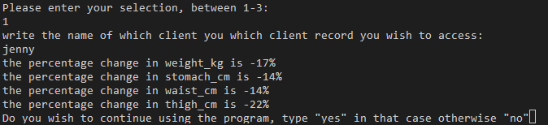
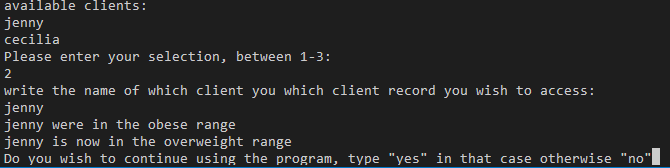
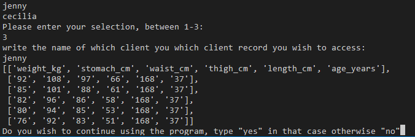

- # Health Terminal

Welcome to the application! :wave:

  > **NOTE:** This is project 3 of 5 of the Code Institute course. This project covers python and its online deployment. 

## Table of Contents

* [Table of Contents](#table-of-contents)
* [Top](#health-terminal)
* [Description](#description)
* [Features](#features)
* [Testing](#testing)
* [Technologies](#technologies)
* [Deployment](#deployment)

  ------

  ------

## Health Terminal

## Description

This project is called “Health terminal” and is based on python. The reason behind the name is that users of this application will be able to access records of fitness clients to review and evaluate their data that is located in a google sheet. The app is deployed using Heroku. 

## Features

### User Stories
* This user is interested in all of the data available on a particular client. What they need is a method for them to be able to clearly see all the data available and what it represents.

* This user is interested in the progress of the client and wants it in a quantifiable and clear way. Thus, they need a feature that is precise both in measuring the change and also where the change has taken place. 

* This user would like to have a qualitative understanding of the clients progress instead of quantitative. Someone who wishes to quickly understand what the overall health level of the client was and their overall health level today. 

### Planned Features

The apps following 7 features will be explained here:-

1. Overview of all the available clients’ which records can be accessed, the function will print out the names individually of all the available worksheets inside the google sheet we are referring to. This is beneficial to the user as they will know which clients records are accessible and can be used with the tools. 

2. A tool menu which displays the available tools for the user to utilize. The functions allow for the data to be displayed and manipulated. 

3. Tool menu option#1. This function takes into account the chosen clients health measurements. It will take the first submitted record and compare it against the last submitted record and present the percentage change. This tells the user the change over time for the chosen client. It will also detail how the measurements have changed for each of the categories. 
4. Tool menu option #2 this function will calculate the clients past and present BMI, inform the user of how the past BMI score was to be interpreted and how the clients BMI fare today. 

5. Tool menu option #3 The third option shows all of the available data for the client from the worksheet. 

6. After a menu option has been utilized the program will ask the user whether they wish to continue. 

7. When the user inputs a invalid input, the user will be prompted to try again

## Testing

### Testing Features

**Feature 1*
This feature is made possible by the toolMenu() function that fetches the worksheets and prints the title of the worksheets using a for loop.

**Feature 2*
Firstly, the user is asked which tool they wish to utilize and secondly which client you wish to utilize that tool. This feature uses print statements to present the options and its part of the toolMenu() function. It also features an input object, and based on the input (between 1-3) it will execute the relevant function. If the user enters something else than specified, they will be shown a error message that states “invalid choice. Enter between 1-3”

**Feature 3*
This feature is delivered using the health_measurements() function that takes the first and last value of the first four columns and calculates the percentage change. Then using an f” statements it prints out the percentage change for each category. Then as seen the user Is prompted with a selection regarding if they wish to continue utilizing the application.

**Feature 4*
This feature is using the bmi_check) function which uses the data available to calculate the bmi, then the value is checked against intervals to see in which range the patient is in. Then the function will print a statement based on which range they belong to. It also checks which range the patient belonged to in the start of their journey.

**Feature 5*
The third feature utilises the all_data_client() function which uses the pprint statement in order to present the table for the user in a more friendly manner.

**Feature 6*
This is made possible using the run_again() function. If the user types yes then the tool_menu() function will run again and if they press no they will be shown a message “Thank you for using….” If they were to enter the answer incorrectly or using upper space they will be asked to enter yes or no more clearly

**Feature 7*
This is handled via various error handling for each function. Also, predicted common input mistakes such as using uppercase and thus implemented lower() method to the input. 

### Testing The User Cases

**User Case 1*
When this user utilizes the application via the terminal they will be greeted and presented with the clients available and features at their disposal. Using feature 1 and specifying which client record they wish to access they will be presented with a table with clear distinction between rows and columns as well as clear column titles so that they know what the data represents. 

**User Case 2*
When this user utilizes the application via the terminal they will be greeted, presented with clients available and features at their disposal. Using feature 2 and specifying the client they wish to access they are presented with the percentage change in each category. 

**User Case 3*
When this user utilizes the application via the terminal they will be greeted, presented with clients available and features at their disposal. Using feature 3 and specifying the client, the application will calculate the BMI of the initial value sand the final values. Then it will take the BMI values and check it against the different ranges as specified by the health board. The user is then presented with which range the client was in and in which range they are enow in. for example, “ (client name) was in the obese range” followed by “(client name) is now in the normal range”.

How I have tested the code:
* The app is run via the terminal and has been tested using both chrome and firefox on desktop, using gitpod and heroku. It is running as expected in the gitpod terminal. When testing it was discovered that heroku does not adequately run a function that is placed under a print statement. Due to this I had to alter the code to take this in consideration and add a statement targeting heroku users without affecting other users too much. To simply press enter to continue. this does trigger the error message, however. The error message was altered so that it is unobtrusive to the user experience, and more of a general instruction.

### Validators
* PEP8 was used via http://pep8online.com/

* pylint was run and installed via the terminal. 

#### Solved bugs

* Using uppercase would result in an error that I used error handling for initially, but now instead opted to transform the input to lowercase using the lower() method. 
* The terminal returned an traceback error which I handled by breaking the application once the user is finished.  

## Technologies

* [Python](https://en.wikipedia.org/wiki/Python_(programming_language))
* [Heroku](https://en.wikipedia.org/wiki/Heroku)

## Deployment

First, add all dependencies to requirements.txt using: pip3 freeze > requirements.txt. Secondly, push and commit to git. That’s for git, and for Heroku we create a new app. Add the name and venture on to the settings before deployment. Add our cred file with our private api key. In buildpacks we add python and node.js, in that order. That’s it for the settings, back to deployment. We connect our github account, search for the repo. Then manually deploy the branch so we are in full control. 

## Citations

* BMI forumla and information used to create the bmi_check() function. 
https://www.nhlbi.nih.gov/health/educational/lose_wt/BMI/bmi-m.htm
*  I utilized the Gspread documentation to efficiently manipulate the worksheets and improve error handling. 
https://docs.gspread.org/en/latest/user-guide.html
* Python quickstart for the Sheets API was used for further reference. 
https://developers.google.com/sheets/api/quickstart/python
* Pylint documentation was used to effectively run pylint.
http://pylint.pycqa.org/en/latest/

