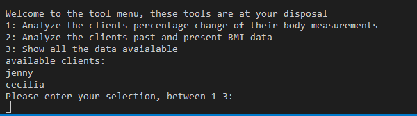

read me file for project 3.

PLANNING
1x. Create a googl sheet with informaton regaridng our clients progress. 
2x. create creds file so that the sheet can be accessed.
3x. add it and then add itto ignore.
4x. show all available sheets,
5x. pick sheet for the cleit you want
6. Be presented the options for you
7. pick option you want and fnction is run and rpesenting you with a list of % change in measuremtns
8x. one function tht calculates BMI change and tells you current state
9x. the other function will give you the percentage change in the meausremtns preented as a list. 
10. third function will do the calculaton and insert it into the sheet. 
11. errors need to be alerted and also possible to try again without crashing or found in no mans land.
12. p3clients
13x. requiremnts to run> imports and also isntall pip3, google ouath gsprad (pip3 install gspread google-auth)
14. used documentation https://docs.gspread.org/en/latest/user-guide.html

create a main fucnton whcih sets allthe variables and then executes the otehr funcitosn so in the menu we will simpy call th emenu funciton again. 

